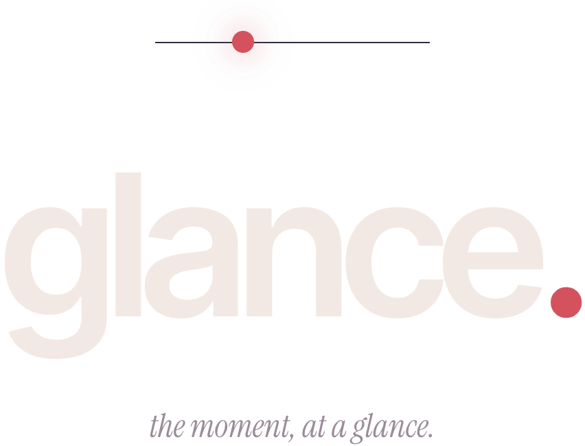
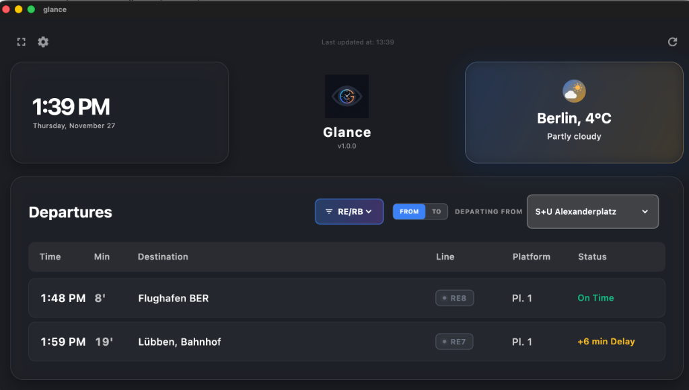

<p align="center">
  
</p>

<h1 align="center">Glance</h1>

<p align="center">
  A landscape-first transit + weather dashboard for the morning rush.<br />
  Built in Flutter, designed for an always-on tablet or kitchen monitor.
</p>

---

## What it shows

A single screen, glanceable from across the room:

- **Hero countdown** — minutes until the next train, plus line, platform, destination.
- **Route rail** — your multi-leg journey to a saved destination (current → interchanges → end), powered by BVG `/journeys`.
- **Up next** — upcoming departures with delays and on-time status.
- **Weather column** — current temperature, the next 8 hours, and a one-line condition summary.

When BVG goes silent for more than four minutes, the dashboard switches to an **offline screen** that shows the last-known countdown (dimmed and struck through), a "what we tried" diagnostics list, and a degraded/operational/outage status card.

## Settings

- **Display** — theme, scale, fullscreen.
- **Departures** — default station, destination station (powers the route rail), transport mode, time window, AI weather suggestions.
- **Weather** — location and AI suggestions.
- **Layout** — four working presets: Editorial · Hero only · Split · Dense.
- **About** — current version + real GitHub release notes for any available update + a 4-release Changelog list.
- **Dev** *(debug-only)* — runtime feature-flag toggles. Release builds ignore stored overrides.

## Sources

- **Transit:** BVG via [`v6.bvg.transport.rest`](https://v6.bvg.transport.rest).
- **Weather:** [Open-Meteo](https://open-meteo.com).
- **Updates:** GitHub Releases.
- **AI suggestions:** Claude Haiku 4.5 (Android only, via ML Kit GenAI).

## Running it

```bash
flutter pub get
flutter run -d macos       # desktop
flutter run -d ios          # iPad simulator
```

Tests + analyzer:

```bash
flutter test
flutter analyze --no-fatal-infos
dart format --set-exit-if-changed .
```

## Screenshots

<p align="center">
  
</p>



> *Dashboard screenshot above is from the previous design; offline-screen and layout-preset renders are pending.*

## License

MIT.
